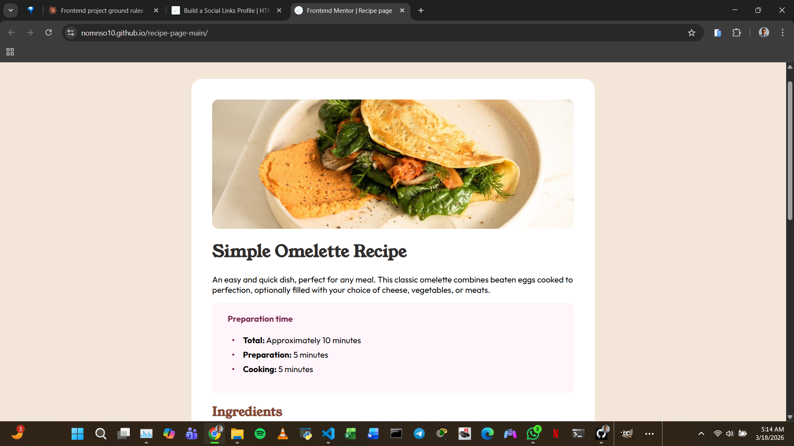

# Frontend Mentor - Recipe page solution

This is a solution to the [Recipe page challenge on Frontend Mentor](https://www.frontendmentor.io/challenges/recipe-page-KiTsR8QQKm). Frontend Mentor challenges help you improve your coding skills by building realistic projects.

## Table of contents

- [Overview](#overview)
  - [The challenge](#the-challenge)
  - [Screenshot](#screenshot)
  - [Links](#links)
- [My process](#my-process)
  - [Built with](#built-with)
  - [What I learned](#what-i-learned)
  - [Continued development](#continued-development)
  - [AI Collaboration](#ai-collaboration)
- [Author](#author)

## Overview

### Screenshot

### Links

- Live Site URL: https://nomnso10.github.io/recipe-page-main/

## My process

### Built with

- Semantic HTML5 markup
- CSS custom properties
- Responsive design (mobile & desktop)

### What I learned

How to use HTML tables for structured data
How to use CSS media queries for responsive design
How to use pseudo-elements for custom bullet points

### Continued development

CSS Flexbox, JavaScript, React

### AI Collaboration

I used Claude to help guide me through the project.

## Author

- Website - [Trenchard](https://www.your-site.com)
- Frontend Mentor - [@nomnso10](https://www.frontendmentor.io/profile/nomnso10)
- Twitter - [@\_\_just_tee](https://x.com/__just_tee)
